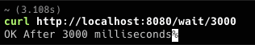

# LatencySimulator

[](https://choosealicense.com/licenses/mit/)
[](https://hub.docker.com/repository/docker/bancolombia/latency-simulator)
[](https://github.com/bancolombia/latency-simulator/actions/workflows/scorecards-analysis.yml)

Latency simulator is a tool that allows you to simulate latency in a distributed environment. It combines the
capabilities of elixir to analyze the behavior of an application in different latency scenarios.

## Installation

At first, you need to download and compile the dependencies:

```bash
mix deps.get
mix deps.compile
```

## Basic Usage

From elixir interactive shell

```bash
iex -S mix
```

From dockerfile

```bash
docker run --rm -it -p 8080:8080 bancolombia/latency-simulator:latest
```

Now, this tool expose an endpoint that allows you to simulate latency, with time in milliseconds as a parameter.

```bash 
curl http://localhost:8080/wait/100 # It'll wait 100 milliseconds
curl http://localhost:8080/wait/3000 # It'll wait 3 seconds
```




## Contribute

If you want to contribute to this project, enable hooks and run tests before commit.

```bash
./enable-hook.sh
```

Documentation can be generated with [ExDoc](https://github.com/elixir-lang/ex_doc)
and published on [HexDocs](https://hexdocs.pm). Once published, the docs can
be found at [https://hexdocs.pm/latency_simulator](https://hexdocs.pm/latency_simulator).

